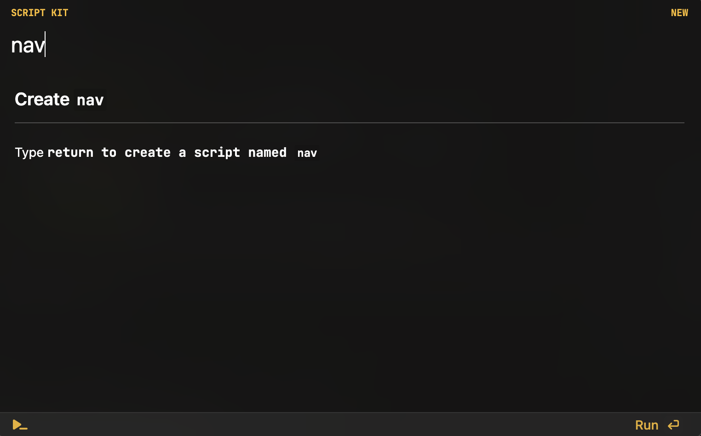
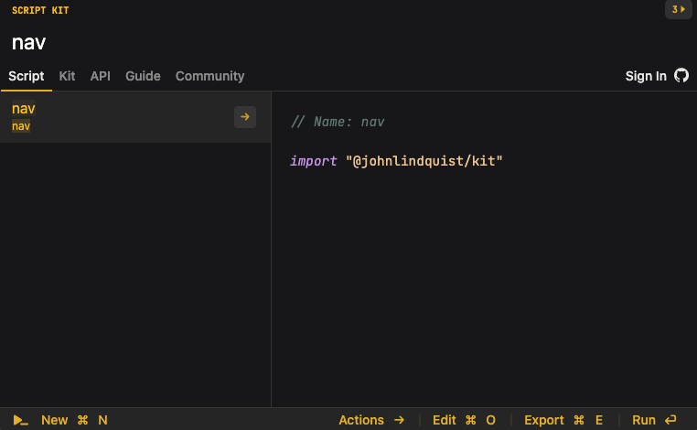
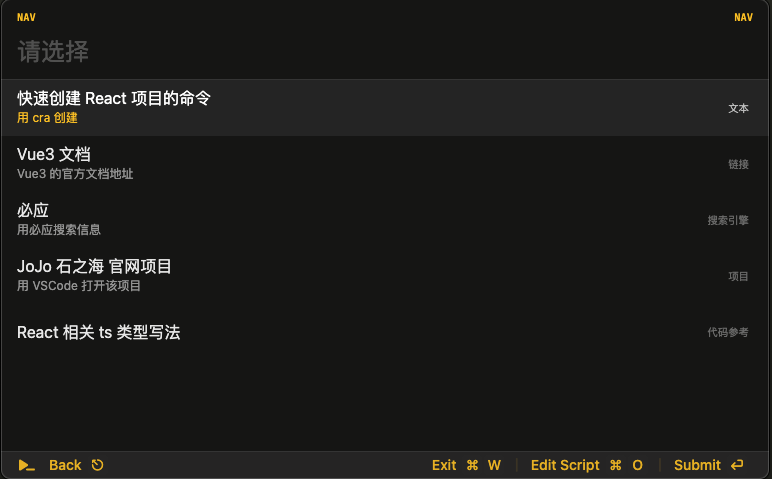
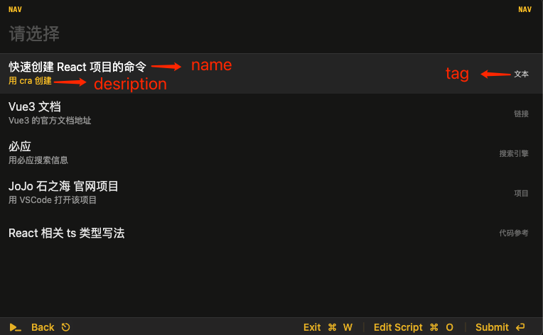
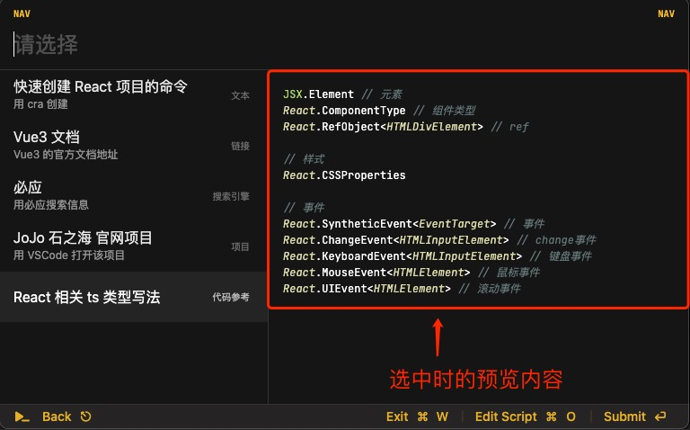

# 用 Script Kit 来优化日常工作流吧
我们的日常工作中，往往充斥着各种琐碎的任务：打开项目，搜索信息，查文档等。这些任务不断的侵蚀着我们的专注力，降低我们的工作效率。

[Script Kit](https://www.scriptkit.com/) 是一个功能强大，易用的启动器(启动器如 Mac 上的 Alfred)。它可以帮助我们快速的完成这些琐碎的任务。

本文来做一个 Demo，实现如下几种任务：
1. 文本搜索。
2. 打开网站。
3. 用搜索引擎搜索信息。
4. 打开项目。
5. 查看代码参考。

演示Demo: [这里](https://www.bilibili.com/video/BV1944y197mP/?vd_source=78df87fda430e2deba784c315a971780)

下面，我们来 Building 吧~

## 第 1 步 安装 Script Kit
在 [官网](https://www.scriptkit.com/) 下载安装包安装。

打开 Script Kit 后，Script Kit 处于最小化状态。展开 Script Kit 有两种方式: 
1. 快捷键 `command + ;`。
2. 点击头部状态栏中的图标。

## 第 2 步 创建脚本
进入 Script Kit 输入脚本的名字，然后回车，就完成了脚本的创建。我们这边的 Demo 的名字叫 `nav`。



Script Kit 创建了如下的脚本文件 `nav.js`

```js
// Name: nav

import "@johnlindquist/kit"
```

其中: 
1. `// Name: nav`: 该脚本的名称。 
2. `import "@johnlindquist/kit"`: 引入基础库。这是必须的。

## 第 3 步 运行脚本
在上面的脚本中添加内容，`div('Hello World!')`:
```js
// Name: nav

import "@johnlindquist/kit"

div('Hello World!')
```

展开 Script Kit(`command + ;`), 输入 `nav`:


按回车运行，会出现如下的结果:


## 第 4 步 制作列表


实现代码如下：
```js
const selected = await arg('请选择', [
  // 文本
  {
    name: '快速创建 React 项目的命令',
    description: '用 cra 创建',
    tag: '文本',
    value: {
      type: 'text',
      content: 'npx create-react-app 项目名称',
    }
  },
  // 链接
  {
    name: 'Vue3 文档',
    description: 'Vue3 的官方文档地址',
    tag: '链接',
    value: {
      type: 'url',
      content: 'https://cn.vuejs.org/guide/introduction.html'
    }
  },
  // 搜索引擎
  {
    name: '必应',
    description: '用必应搜索信息',
    tag: '搜索引擎',
    value: {
      type: 'search-engine',
      content: 'https://cn.bing.com/search?q={q}'
    }
  },
  // 项目
  {
    name: 'JoJo 石之海 官网项目',
    description: '用 VSCode 打开该项目',
    tag: '项目',
    value: {
      type: 'project',
      content: home('project/jojo/website')
    }
  },
  // 代码参考
  {
    name: 'React 相关 ts 类型写法',
    tag: '代码参考',
    preview:  async () => {
      const code = await highlightCode({
        contents: codeContent, 
        language: 'javascript'
      })
      return code
    },
    value: {
      type: 'search-engine',
      content: 'https://cn.bing.com/search?q={q}'
    }
  },
])
```

列表中的每个选项对应上面数组中一个 item。内容和代码的对应关系如下：  


value 是用户选择后，程序接收到的值。用 type 来标识不同的 item 类型。后面会根据不同的 type，做不同的处理。

item 中的 preview 是设置选中时的预览内容。如下图所示：


上图中的代码预览用的第三方包：`highlight.js`。实现代码如下：
```js
const wrapCode = (html) => `<pre class="px-4">
<style type="text/css">
  code {
    font-size: 0.75rem !important;
    width: 100%;
    white-space: pre-wrap;
  }
  pre {
    display: flex;
  }
  p {
    margin-bottom: 1rem;
  }
</style>
  <code>
${html.trim()}
  </code>
</pre>`;

const highlightCode = async ({ contents, language }) => {
  const { default: highlight } = await npm("highlight.js");
  let highlightedContents = language
    ? highlight.highlight(contents, { language }).value
    : highlight.highlightAuto(contents).value;

  return wrapCode(highlightedContents);
};
```

可以看到，在脚本中使用 npm 包只要这么写：`await npm("包名")`。

## 第 5 步 选择后的处理
对选择不同类型的内容，做不同的处理：
* 选中文本：将文本复制到粘贴板。
* 选中链接：在浏览器中打开链接。
* 选中搜索引擎：输入关键字，用搜索引擎搜索。
* 选中项目：在 VSCode 中打开项目。

代码如下：
```js
const {
  content,
  type,
} = selected

switch(type) {
  // 文本
  case 'text':
    copy(content) // 将文本复制到粘贴板。
    break
  // 链接
  case 'url':
    browse(content) // 用浏览器打开。
    break
  // 搜索引擎
  case 'search-engine':
    const query = await arg('关键字:')
    const url = content.replace('{q}', encodeURIComponent(query))
    browse(url)
    break
  // 项目
  case 'project':
    exec(`code ${content}`) // 用 VSCode  打开。
    break
}
```

上面的 `copy`, `browse`, `exec` 是 Script Kit 内置的功能。Script Kit 内置了茫茫多的功能。

## 第 6 步 细节优化
### 自定义脚本名称并加上描述信息
代码如下:
```
// Name: 导航
// Description: 快速访问文本信息，网站，搜索引擎，项目和代码参考。
```

效果如下：


### 设置启动该脚本的快捷键
```js
// Shortcut: cmd shift 0
```

按住 `cmd + shift + 0`，可以直接运行脚本。

### 加交互反馈
文本内容复制到粘贴板，加交互提示：
```js
copy(content) // 将文本复制到粘贴板。
new applescript(`display alert "内容已拷贝到粘贴板"`)
```

完整代码: [这里](https://github.com/iamjoel/rocket/blob/main/code/glue/script-kit/intro/nav.js)

## 其他功能
本文介绍的只是 Script Kit 功能的冰山一角。

可以通过 [AppleScript](https://developer.apple.com/library/archive/documentation/AppleScript/Conceptual/AppleScriptLangGuide/introduction/ASLR_intro.html) 和 本地应用交互。比如，如下脚本实现了关闭所有的 Finder 窗口：
```js
new applescript(`
tell application "Finder"
	set theWindowList to windows
	repeat with i from 1 to number of items in theWindowList
		set this_item to item i of theWindowList
		set windowName to name of this_item
		close this_item
	end repeat
end tell
`)
```

调接口来查询网上的信息，生成摘要并显示。比如，查询图书信息信息
```js
let query = await arg('Search for a book title:')

//This API can be a little slow. Wait a couple seconds
let response = await get(`http://openlibrary.org/search.json?q=${query}`)

let transform = ({title, author_name}) =>
  `* "${title}" - ${author_name?.length && author_name[0]}`

let markdown = response.data.docs.map(transform).join('\n')

inspect(markdown, 'md')
```

用定时任务来做定时需要做的事。每天间隔2个小时提醒喝水。

## 常见问题
### 如何调试?
```
inspect(内容)
```

### 支持哪些全局对象
常用的：
```js
// 展示内容
div // 渲染 html 内容
md: Markdown // 渲染 markdown 内容
terminal: (script: string) => Promise<string> // 打开命令行，并执行脚本

// 接口调用。用的是 Axios。
get: AxiosInstance["get"]
put: AxiosInstance["put"]
post: AxiosInstance["post"]
patch: AxiosInstance["patch"]

// 文件操作
readFile: typeof fsPromises.readFile
writeFile: typeof fsPromises.writeFile
appendFile: typeof fsPromises.appendFile
createWriteStream: typeof fs.createWriteStream
readdir: typeof fsPromises.readdir
cd: typeof shelljs.cd
cp: typeof shelljs.cp
chmod: typeof shelljs.chmod
ls: typeof shelljs.ls
mkdir: typeof shelljs.mkdir
mv: typeof shelljs.mv

// 存取数据
db: DB
```

所有的见[这里](https://github.com/johnlindquist/kit/discussions/187)。


